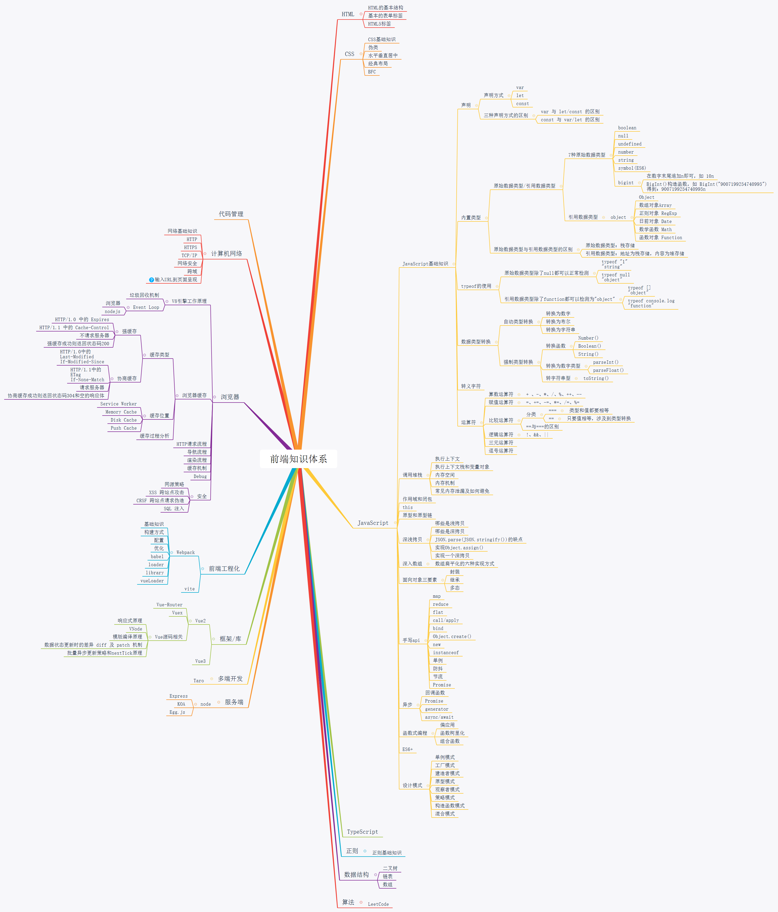

# 自我认知

# 目录

## HTML

- HTML5 标签

## CSS

- CSS 基础知识

- 伪类

- 水平居中

- 布局

- BFC

- CSS3

## JavaScript

- [JS 继承](./JavaScript/JS继承.md)
- [Promise 和 Async 一步到位](./JavaScript/Promise和Async一步到位.md)
- [手写 promise-Es6](./JavaScript/promise.md)

## 计算机网络

- [输入 url 到页面显示发生了什么？](./计算机网络/url/url.md)
- [跨域](./计算机网络/跨域/index.md)

## 框架/库

- [vue 源码部分](./框架/vue源码部分/源码解析.md)

## 前端工程化

- [webpack ](./前端工程化/webpack初上手.md)

## 服务端

## 多端开发

## 代码管理

## 数据结构

## 算法/数学

- [排列组合](./算法和数学/排列组合.md)

## 浏览器

- [ChromeDevtools](./浏览器/chrome-devtools.md)
- [浏览器缓存](./浏览器/浏览器缓存/index.md)
