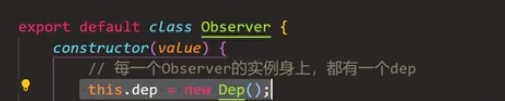

# mustache 模板引擎

## 什么是 mustache

**模板引擎**是数据变成视图最优雅的解决方案


```js
// 数据
let arr = [
    { "name": "小明", "age": 12, "sex": "男" },
    { "name": "小红", "age": 11, "sex": "女" },
    { "name": "小强", "age": 13, "sex": "男" }
]

let list = document.getElementById('list')
```


- 纯 DOM 法

```js
for (let i = 0; i < arr.length; i++) {
    let oLi = document.createElement('li')
    // 中间执行一系列 dom 操作
    list.appendChild(oLi)
}
```


- 数组 join 法

```js
// 遍历arr数组，每遍历一项，就以字符串的视角将HTML字符串添加到list中
for (let i = 0; i < arr.length; i++) {
    list.innerHTML += [
        '<li>',
        '    <div class="hd">' + arr[i].name + '的信息</div>',
        '    <div class="bd">',
        '        <p>姓名：' + arr[i].name + '</p>',
        '        <p>年龄：' + arr[i].age  + '</p>',
        '        <p>性别：' + arr[i].sex + '</p>',
        '    </div>',
        '</li>'
    ].join('')
}
```


- ES6 的反问号法

```js
// 遍历arr数组，每遍历一项，就以字符串的视角将HTML字符串添加到list中
for (let i = 0; i < arr.length; i++) {
    list.innerHTML += `
    <li>
    <div class="hd">${arr[i].name}的基本信息</div>    
    <div class="bd">
    <p>姓名：${arr[i].name}</p>    
    <p>性别：${arr[i].sex}</p>    
    <p>年龄：${arr[i].age}</p>    
    </div>    
</li>
`;
}
```


- 模板引擎

```html
<body>
    <div id="container"></div>

    <script src="jslib/mustache.js"></script>
    <script>
        var templateStr = `
            <h1>我买了一个{{thing}}，好{{mood}}啊</h1>
        `;

        var data = {
            thing: '华为手机',
            mood: '开心'
        };

        var domStr = Mustache.render(templateStr, data);
        
        var container = document.getElementById('container');
        container.innerHTML = domStr;
    </script>
</body>
```


>  mustache 是“胡子” 的意思，因为它嵌入标记 {{ }}{{ }}{{ }}{{ }}{{ }}非常像胡子
>  {{ }}{{ }}{{ }}{{ }}{{ }}的语法也被 Vue 沿用 
>
> [github 仓库](https://github.com/janl/mustache.js)


### 原理

#### 简单原理(为了理解)

```js
<script>
        var templateStr = '<h1>我买了一个{{thing}}，花了{{money}}元，好{{mood}}</h1>';

        var data = {
            thing: '白菜',
            money: 5,
            mood: '激动'
        };

        // 最简单的模板引擎的实现机理，利用的是正则表达式中的replace()方法。
        // replace()的第二个参数可以是一个函数，这个函数提供捕获的东西的参数，就是$1
        // 结合data对象，即可进行智能的替换
        function render(templateStr, data) {
            return templateStr.replace(/\{\{(\w+)\}\}/g, function (findStr, $1) {
                return data[$1];
            });
        }

        var result = render(templateStr, data);
        console.log(result);
    </script>
```


#### 实际原理


# 虚拟 DOM 和 Diff 算法

## snabbdom

snabbdom 是瑞典语单词，原意“速度”。

[snabbdom](https://github.com/snabbdom/snabbdom) 是著名的虚拟 DOM 库，是 diff 算法的鼻祖， Vue 源码借鉴了 snabbdom。


### 疑问

### 1. **虚拟 DOM 如何被渲染函数（h函数）产生？**

[h函数源码](https://github.com/snabbdom/snabbdom/blob/master/src/h.ts)

使用 `h函数`

```js
h('a', {props: {href: 'https://github.com/PL-FE'}}, 'Github')
```

虚拟 DOM

```json
{
    "sel": "a",
    "data":{
        props: {
            href: 'https://github.com/PL-FE'
        }
    },
    "text": 'Github'
}
```

真实DOM

```html
<a href="https://github.com/PL-FE">Github</a>
```


### 2. **diff算法原理**

**patch**

**n. 色斑;斑点;(与周围不同的)小块，小片;补丁;补块;眼罩**
**v. 打补丁;缝补;修补**


最开始不管是不是虚拟节点都转成虚拟节点。

然后比较 sel 和 key 是否都相同，不相同则直接删除旧的，插入新的。

相同进入下一步，两个节点互相比较。`patchVnode(oldVnode, newVnode);`

```js
function vnode(sel, data, children, text, elm) {
    const key = data.key;
    return {
        sel, data, children, text, elm, key
    };
}

function patch(oldVnode, newVnode) {
    // 判断传入的第一个参数，是DOM节点还是虚拟节点？
    if (oldVnode.sel == '' || oldVnode.sel == undefined) {
        // 传入的第一个参数是DOM节点，此时要包装为虚拟节点
        oldVnode = vnode(oldVnode.tagName.toLowerCase(), {}, [], undefined, oldVnode);
    }

    // 判断oldVnode和newVnode是不是同一个节点
    if (oldVnode.key == newVnode.key && oldVnode.sel == newVnode.sel) {
        console.log('是同一个节点');
        patchVnode(oldVnode, newVnode);
    } else {
        console.log('不是同一个节点，暴力插入新的，删除旧的');
        let newVnodeElm = createElement(newVnode);
        
        // 插入到老节点之前
        if (oldVnode.elm.parentNode && newVnodeElm) {
            oldVnode.elm.parentNode.insertBefore(newVnodeElm, oldVnode.elm);
        }
        // 删除老节点
        oldVnode.elm.parentNode.removeChild(oldVnode.elm);
    }
};
```
两个节点开始先确认是否是同一个对象，如果是就什么也不做。

不是同一个对象的话，先判断新节点有没有 `text`，`text` 是否相同。不同的话直接 `oldVnode.elm.innerText = newVnode.text;`，完事儿。

判断完了新节点没有 `text`，那么就是新节点有 `children`。

再来判断旧节点有 `text` 还是有 `children`。

如果旧节点有 `text`。即当前新节点有 `children`，旧节点有 `text`。那么新节点的 `children`将取代旧节点的 `text`。实操是先删后加。

```js
// 老的没有children，新的有children
// 清空老的节点的内容
oldVnode.elm.innerHTML = '';
// 遍历新的vnode的子节点，创建DOM，上树
for (let i = 0; i < newVnode.children.length; i++) {
    let dom = createElement(newVnode.children[i]);
    oldVnode.elm.appendChild(dom);
}
```

如果旧节点有 `children`。即当前新节点有 `children`，旧节点有 `children`。

那么这个时候就是`最复杂的情况`了。`updateChildren(oldVnode.elm, oldVnode.children, newVnode.children);`

```js
function patchVnode(oldVnode, newVnode) {
    // 判断新旧vnode是否是同一个对象
    if (oldVnode === newVnode) return;
    // 判断新vnode有没有text属性
    if (newVnode.text != undefined && (newVnode.children == undefined || newVnode.children.length == 0)) {
        // 新vnode有text属性
        console.log('新vnode有text属性');
        if (newVnode.text != oldVnode.text) {
            // 如果新虚拟节点中的text和老的虚拟节点的text不同，那么直接让新的text写入老的elm中即可。如果老的elm中是children，那么也会立即消失掉。
            oldVnode.elm.innerText = newVnode.text;
        }
    } else {
        // 新vnode没有text属性，有children
        console.log('新vnode没有text属性');
        // 判断老的有没有children
        if (oldVnode.children != undefined && oldVnode.children.length > 0) {
            // 老的有children，新的也有children，此时就是最复杂的情况。
            updateChildren(oldVnode.elm, oldVnode.children, newVnode.children);
        } else {
            // 老的没有children，新的有children
            // 清空老的节点的内容
            oldVnode.elm.innerHTML = '';
            // 遍历新的vnode的子节点，创建DOM，上树
            for (let i = 0; i < newVnode.children.length; i++) {
                let dom = createElement(newVnode.children[i]);
                oldVnode.elm.appendChild(dom);
            }
        }
    }
}
```

最复杂的情况

使用命中查找。

① 新前与旧后

② 新后与旧前

③ 新后与旧后（发生节点移动，新前指向的节点移动到旧后之后）

④ 新前与旧前（发生节点移动，新前指向的节点移动到旧前之前）

命中一种就停止

如果都没命中,调用循环来寻找。移动到旧前之前。

```js
// 真正创建节点。将vnode创建为DOM，是孤儿节点，不进行插入
function createElement(vnode) {
    // console.log('目的是把虚拟节点', vnode, '真正变为DOM');
    // 创建一个DOM节点，这个节点现在还是孤儿节点
    let domNode = document.createElement(vnode.sel);
    // 有子节点还是有文本？？
    if (vnode.text != '' && (vnode.children == undefined || vnode.children.length == 0)) {
        // 它内部是文字
        domNode.innerText = vnode.text;
    } else if (Array.isArray(vnode.children) && vnode.children.length > 0) {
        // 它内部是子节点，就要递归创建节点
        for (let i = 0; i < vnode.children.length; i++) {
            // 得到当前这个children
            let ch = vnode.children[i];
            // 创建出它的DOM，一旦调用createElement意味着：创建出DOM了，并且它的elm属性指向了创建出的DOM，但是还没有上树，是一个孤儿节点。
            let chDOM = createElement(ch);
            // 上树
            domNode.appendChild(chDOM);
        }
    }
    // 补充elm属性
    vnode.elm = domNode;
   
    // 返回elm，elm属性是一个纯DOM对象
    return vnode.elm;
};

// 判断是否是同一个虚拟节点
function checkSameVnode(a, b) {
    return a.sel == b.sel && a.key == b.key;
};

function updateChildren(parentElm, oldCh, newCh) {
    console.log('我是updateChildren');
    console.log(oldCh, newCh);

    // 旧前
    let oldStartIdx = 0;
    // 新前
    let newStartIdx = 0;
    // 旧后
    let oldEndIdx = oldCh.length - 1;
    // 新后
    let newEndIdx = newCh.length - 1;
    // 旧前节点
    let oldStartVnode = oldCh[0];
    // 旧后节点
    let oldEndVnode = oldCh[oldEndIdx];
    // 新前节点
    let newStartVnode = newCh[0];
    // 新后节点
    let newEndVnode = newCh[newEndIdx];

    let keyMap = null;

    // 开始大while了
    while (oldStartIdx <= oldEndIdx && newStartIdx <= newEndIdx) {
        console.log('★');
        // 首先不是判断①②③④命中，而是要略过已经加undefined标记的东西
        if (oldStartVnode == null || oldCh[oldStartIdx] == undefined) {
            oldStartVnode = oldCh[++oldStartIdx];
        } else if (oldEndVnode == null || oldCh[oldEndIdx] == undefined) {
            oldEndVnode = oldCh[--oldEndIdx];
        } else if (newStartVnode == null || newCh[newStartIdx] == undefined) {
            newStartVnode = newCh[++newStartIdx];
        } else if (newEndVnode == null || newCh[newEndIdx] == undefined) {
            newEndVnode = newCh[--newEndIdx];
        } else if (checkSameVnode(oldStartVnode, newStartVnode)) {
            // 新前和旧前
            console.log('①新前和旧前命中');
            patchVnode(oldStartVnode, newStartVnode);
            oldStartVnode = oldCh[++oldStartIdx];
            newStartVnode = newCh[++newStartIdx];
        } else if (checkSameVnode(oldEndVnode, newEndVnode)) {
            // 新后和旧后
            console.log('②新后和旧后命中');
            patchVnode(oldEndVnode, newEndVnode);
            oldEndVnode = oldCh[--oldEndIdx];
            newEndVnode = newCh[--newEndIdx];
        } else if (checkSameVnode(oldStartVnode, newEndVnode)) {
            // 新后和旧前
            console.log('③新后和旧前命中');
            patchVnode(oldStartVnode, newEndVnode);
            // 当③新后与旧前命中的时候，此时要移动节点。移动新前指向的这个节点到老节点的旧后的后面
            // 如何移动节点？？只要你插入一个已经在DOM树上的节点，它就会被移动
            parentElm.insertBefore(oldStartVnode.elm, oldEndVnode.elm.nextSibling);
            oldStartVnode = oldCh[++oldStartIdx];
            newEndVnode = newCh[--newEndIdx];
        } else if (checkSameVnode(oldEndVnode, newStartVnode)) {
            // 新前和旧后
            console.log('④新前和旧后命中');
            patchVnode(oldEndVnode, newStartVnode);
            // 当④新前和旧后命中的时候，此时要移动节点。移动新前指向的这个节点到老节点的旧前的前面
            parentElm.insertBefore(oldEndVnode.elm, oldStartVnode.elm);
            // 如何移动节点？？只要你插入一个已经在DOM树上的节点，它就会被移动
            oldEndVnode = oldCh[--oldEndIdx];
            newStartVnode = newCh[++newStartIdx];
        } else {
            // 四种命中都没有命中
            // 制作keyMap一个映射对象，这样就不用每次都遍历老对象了。
            if (!keyMap) {
                keyMap = {};
                // 从oldStartIdx开始，到oldEndIdx结束，创建keyMap映射对象
                for (let i = oldStartIdx; i <= oldEndIdx; i++) {
                    const key = oldCh[i].key;
                    if (key != undefined) {
                        keyMap[key] = i;
                    }
                }
            }
            console.log(keyMap);
            // 寻找当前这项（newStartIdx）这项在keyMap中的映射的位置序号
            const idxInOld = keyMap[newStartVnode.key];
            console.log(idxInOld);
            if (idxInOld == undefined) {
                // 判断，如果idxInOld是undefined表示它是全新的项
                // 被加入的项（就是newStartVnode这项)现不是真正的DOM节点
                parentElm.insertBefore(createElement(newStartVnode), oldStartVnode.elm);
            } else {
                // 如果不是undefined，不是全新的项，而是要移动
                const elmToMove = oldCh[idxInOld];
                patchVnode(elmToMove, newStartVnode);
                // 把这项设置为undefined，表示我已经处理完这项了
                oldCh[idxInOld] = undefined;
                // 移动，调用insertBefore也可以实现移动。
                parentElm.insertBefore(elmToMove.elm, oldStartVnode.elm);
            }
            // 指针下移，只移动新的头
            newStartVnode = newCh[++newStartIdx];
        }
    }

    // 继续看看有没有剩余的。循环结束了start还是比old小
    if (newStartIdx <= newEndIdx) {
        console.log('new还有剩余节点没有处理，要加项。要把所有剩余的节点，都要插入到oldStartIdx之前');
        // 遍历新的newCh，添加到老的没有处理的之前
        for (let i = newStartIdx; i <= newEndIdx; i++) {
            // insertBefore方法可以自动识别null，如果是null就会自动排到队尾去。和appendChild是一致了。
            // newCh[i]现在还没有真正的DOM，所以要调用createElement()函数变为DOM
            parentElm.insertBefore(createElement(newCh[i]), oldCh[oldStartIdx].elm);
        }
    } else if (oldStartIdx <= oldEndIdx) {
        console.log('old还有剩余节点没有处理，要删除项');
        // 批量删除oldStart和oldEnd指针之间的项
        for (let i = oldStartIdx; i <= oldEndIdx; i++) {
            if (oldCh[i]) {
                parentElm.removeChild(oldCh[i].elm);
            }
        }
    }
};
```


### 3. **虚拟DOM如何通过diff变为真正的DOM？**

在 diff 过程中，借用旧节点上树。

# 数据响应式原理

每个 Observe 都有一个 Dep 实例。




# AST 抽象语法树

