# mustache 模板引擎

## 什么是 mustache

**模板引擎**是数据变成视图最优雅的解决方案


```js
// 数据
let arr = [
    { "name": "小明", "age": 12, "sex": "男" },
    { "name": "小红", "age": 11, "sex": "女" },
    { "name": "小强", "age": 13, "sex": "男" }
]

let list = document.getElementById('list')
```


- 纯 DOM 法

```js
for (let i = 0; i < arr.length; i++) {
    let oLi = document.createElement('li')
    // 中间执行一系列 dom 操作
    list.appendChild(oLi)
}
```


- 数组 join 法

```js
// 遍历arr数组，每遍历一项，就以字符串的视角将HTML字符串添加到list中
for (let i = 0; i < arr.length; i++) {
    list.innerHTML += [
        '<li>',
        '    <div class="hd">' + arr[i].name + '的信息</div>',
        '    <div class="bd">',
        '        <p>姓名：' + arr[i].name + '</p>',
        '        <p>年龄：' + arr[i].age  + '</p>',
        '        <p>性别：' + arr[i].sex + '</p>',
        '    </div>',
        '</li>'
    ].join('')
}
```


- ES6 的反问号法

```js
// 遍历arr数组，每遍历一项，就以字符串的视角将HTML字符串添加到list中
for (let i = 0; i < arr.length; i++) {
    list.innerHTML += `
    <li>
    <div class="hd">${arr[i].name}的基本信息</div>    
    <div class="bd">
    <p>姓名：${arr[i].name}</p>    
    <p>性别：${arr[i].sex}</p>    
    <p>年龄：${arr[i].age}</p>    
    </div>    
</li>
`;
}
```


- 模板引擎

```html
<body>
    <div id="container"></div>

    <script src="jslib/mustache.js"></script>
    <script>
        var templateStr = `
            <h1>我买了一个{{thing}}，好{{mood}}啊</h1>
        `;

        var data = {
            thing: '华为手机',
            mood: '开心'
        };

        var domStr = Mustache.render(templateStr, data);
        
        var container = document.getElementById('container');
        container.innerHTML = domStr;
    </script>
</body>
```


>  mustache 是“胡子” 的意思，因为它嵌入标记 {{ }}{{ }}{{ }}{{ }}{{ }}非常像胡子
>  {{ }}{{ }}{{ }}{{ }}{{ }}的语法也被 Vue 沿用 
>
> [github 仓库](https://github.com/janl/mustache.js)


### 原理

#### 简单原理(为了理解)

```js
<script>
        var templateStr = '<h1>我买了一个{{thing}}，花了{{money}}元，好{{mood}}</h1>';

        var data = {
            thing: '白菜',
            money: 5,
            mood: '激动'
        };

        // 最简单的模板引擎的实现机理，利用的是正则表达式中的replace()方法。
        // replace()的第二个参数可以是一个函数，这个函数提供捕获的东西的参数，就是$1
        // 结合data对象，即可进行智能的替换
        function render(templateStr, data) {
            return templateStr.replace(/\{\{(\w+)\}\}/g, function (findStr, $1) {
                return data[$1];
            });
        }

        var result = render(templateStr, data);
        console.log(result);
    </script>
```


#### 实际原理


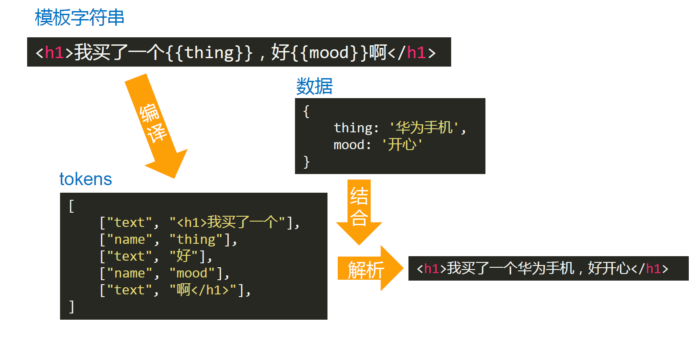


# 虚拟 DOM 和 Diff 算法

## snabbdom

snabbdom 是瑞典语单词，原意“速度”。

[snabbdom](https://github.com/snabbdom/snabbdom) 是著名的虚拟 DOM 库，是 diff 算法的鼻祖， Vue 源码借鉴了 snabbdom。


### 疑问

### 1. **虚拟 DOM 如何被渲染函数（h函数）产生？**

[h函数源码](https://github.com/snabbdom/snabbdom/blob/master/src/h.ts)

使用 `h函数`

```js
h('a', {props: {href: 'https://github.com/PL-FE'}}, 'Github')
```

虚拟 DOM

```json
{
    "sel": "a",
    "data":{
        props: {
            href: 'https://github.com/PL-FE'
        }
    },
    "text": 'Github'
}
```

真实DOM

```html
<a href="https://github.com/PL-FE">Github</a>
```


### 2. **diff算法原理**

**patch**

**n. 色斑;斑点;(与周围不同的)小块，小片;补丁;补块;眼罩**
**v. 打补丁;缝补;修补**

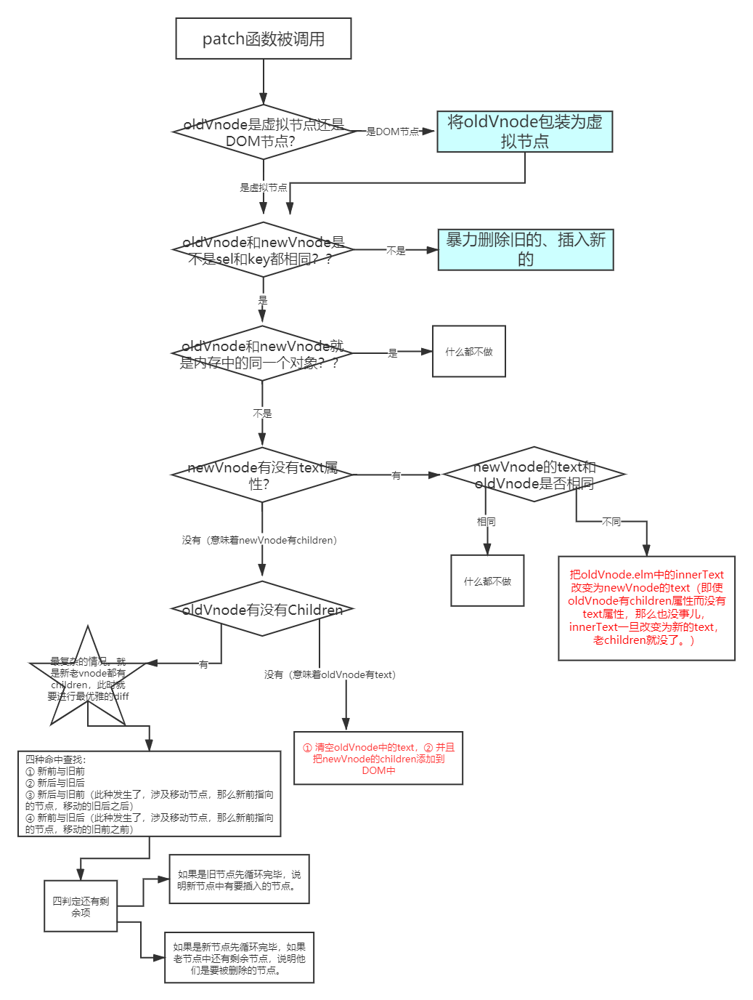

最开始不管是不是虚拟节点都转成虚拟节点。

然后比较 sel 和 key 是否都相同，不相同则直接删除旧的，插入新的。

相同进入下一步，两个节点互相比较。`patchVnode(oldVnode, newVnode);`

```js
function vnode(sel, data, children, text, elm) {
    const key = data.key;
    return {
        sel, data, children, text, elm, key
    };
}

function patch(oldVnode, newVnode) {
    // 判断传入的第一个参数，是DOM节点还是虚拟节点？
    if (oldVnode.sel == '' || oldVnode.sel == undefined) {
        // 传入的第一个参数是DOM节点，此时要包装为虚拟节点
        oldVnode = vnode(oldVnode.tagName.toLowerCase(), {}, [], undefined, oldVnode);
    }

    // 判断oldVnode和newVnode是不是同一个节点
    if (oldVnode.key == newVnode.key && oldVnode.sel == newVnode.sel) {
        console.log('是同一个节点');
        patchVnode(oldVnode, newVnode);
    } else {
        console.log('不是同一个节点，暴力插入新的，删除旧的');
        let newVnodeElm = createElement(newVnode);
        
        // 插入到老节点之前
        if (oldVnode.elm.parentNode && newVnodeElm) {
            oldVnode.elm.parentNode.insertBefore(newVnodeElm, oldVnode.elm);
        }
        // 删除老节点
        oldVnode.elm.parentNode.removeChild(oldVnode.elm);
    }
};
```
两个节点开始先确认是否是同一个对象，如果是就什么也不做。

不是同一个对象的话，先判断新节点有没有 `text`，`text` 是否相同。不同的话直接 `oldVnode.elm.innerText = newVnode.text;`，完事儿。

判断完了新节点没有 `text`，那么就是新节点有 `children`。

再来判断旧节点有 `text` 还是有 `children`。

如果旧节点有 `text`。即当前新节点有 `children`，旧节点有 `text`。那么新节点的 `children`将取代旧节点的 `text`。实操是先删后加。

```js
// 老的没有children，新的有children
// 清空老的节点的内容
oldVnode.elm.innerHTML = '';
// 遍历新的vnode的子节点，创建DOM，上树
for (let i = 0; i < newVnode.children.length; i++) {
    let dom = createElement(newVnode.children[i]);
    oldVnode.elm.appendChild(dom);
}
```

如果旧节点有 `children`。即当前新节点有 `children`，旧节点有 `children`。

那么这个时候就是`最复杂的情况`了。`updateChildren(oldVnode.elm, oldVnode.children, newVnode.children);`

```js
function patchVnode(oldVnode, newVnode) {
    // 判断新旧vnode是否是同一个对象
    if (oldVnode === newVnode) return;
    // 判断新vnode有没有text属性
    if (newVnode.text != undefined && (newVnode.children == undefined || newVnode.children.length == 0)) {
        // 新vnode有text属性
        console.log('新vnode有text属性');
        if (newVnode.text != oldVnode.text) {
            // 如果新虚拟节点中的text和老的虚拟节点的text不同，那么直接让新的text写入老的elm中即可。如果老的elm中是children，那么也会立即消失掉。
            oldVnode.elm.innerText = newVnode.text;
        }
    } else {
        // 新vnode没有text属性，有children
        console.log('新vnode没有text属性');
        // 判断老的有没有children
        if (oldVnode.children != undefined && oldVnode.children.length > 0) {
            // 老的有children，新的也有children，此时就是最复杂的情况。
            updateChildren(oldVnode.elm, oldVnode.children, newVnode.children);
        } else {
            // 老的没有children，新的有children
            // 清空老的节点的内容
            oldVnode.elm.innerHTML = '';
            // 遍历新的vnode的子节点，创建DOM，上树
            for (let i = 0; i < newVnode.children.length; i++) {
                let dom = createElement(newVnode.children[i]);
                oldVnode.elm.appendChild(dom);
            }
        }
    }
}
```

最复杂的情况

使用命中查找。

① 新前与旧后

② 新后与旧前

③ 新后与旧后（发生节点移动，新前指向的节点移动到旧后之后）

④ 新前与旧前（发生节点移动，新前指向的节点移动到旧前之前）

命中一种就停止

如果都没命中,调用循环来寻找。移动到旧前之前。

```js
// 真正创建节点。将vnode创建为DOM，是孤儿节点，不进行插入
function createElement(vnode) {
    // console.log('目的是把虚拟节点', vnode, '真正变为DOM');
    // 创建一个DOM节点，这个节点现在还是孤儿节点
    let domNode = document.createElement(vnode.sel);
    // 有子节点还是有文本？？
    if (vnode.text != '' && (vnode.children == undefined || vnode.children.length == 0)) {
        // 它内部是文字
        domNode.innerText = vnode.text;
    } else if (Array.isArray(vnode.children) && vnode.children.length > 0) {
        // 它内部是子节点，就要递归创建节点
        for (let i = 0; i < vnode.children.length; i++) {
            // 得到当前这个children
            let ch = vnode.children[i];
            // 创建出它的DOM，一旦调用createElement意味着：创建出DOM了，并且它的elm属性指向了创建出的DOM，但是还没有上树，是一个孤儿节点。
            let chDOM = createElement(ch);
            // 上树
            domNode.appendChild(chDOM);
        }
    }
    // 补充elm属性
    vnode.elm = domNode;
   
    // 返回elm，elm属性是一个纯DOM对象
    return vnode.elm;
};

// 判断是否是同一个虚拟节点
function checkSameVnode(a, b) {
    return a.sel == b.sel && a.key == b.key;
};

function updateChildren(parentElm, oldCh, newCh) {
    console.log('我是updateChildren');
    console.log(oldCh, newCh);

    // 旧前
    let oldStartIdx = 0;
    // 新前
    let newStartIdx = 0;
    // 旧后
    let oldEndIdx = oldCh.length - 1;
    // 新后
    let newEndIdx = newCh.length - 1;
    // 旧前节点
    let oldStartVnode = oldCh[0];
    // 旧后节点
    let oldEndVnode = oldCh[oldEndIdx];
    // 新前节点
    let newStartVnode = newCh[0];
    // 新后节点
    let newEndVnode = newCh[newEndIdx];

    let keyMap = null;

    // 开始大while了
    while (oldStartIdx <= oldEndIdx && newStartIdx <= newEndIdx) {
        console.log('★');
        // 首先不是判断①②③④命中，而是要略过已经加undefined标记的东西
        if (oldStartVnode == null || oldCh[oldStartIdx] == undefined) {
            oldStartVnode = oldCh[++oldStartIdx];
        } else if (oldEndVnode == null || oldCh[oldEndIdx] == undefined) {
            oldEndVnode = oldCh[--oldEndIdx];
        } else if (newStartVnode == null || newCh[newStartIdx] == undefined) {
            newStartVnode = newCh[++newStartIdx];
        } else if (newEndVnode == null || newCh[newEndIdx] == undefined) {
            newEndVnode = newCh[--newEndIdx];
        } else if (checkSameVnode(oldStartVnode, newStartVnode)) {
            // 新前和旧前
            console.log('①新前和旧前命中');
            patchVnode(oldStartVnode, newStartVnode);
            oldStartVnode = oldCh[++oldStartIdx];
            newStartVnode = newCh[++newStartIdx];
        } else if (checkSameVnode(oldEndVnode, newEndVnode)) {
            // 新后和旧后
            console.log('②新后和旧后命中');
            patchVnode(oldEndVnode, newEndVnode);
            oldEndVnode = oldCh[--oldEndIdx];
            newEndVnode = newCh[--newEndIdx];
        } else if (checkSameVnode(oldStartVnode, newEndVnode)) {
            // 新后和旧前
            console.log('③新后和旧前命中');
            patchVnode(oldStartVnode, newEndVnode);
            // 当③新后与旧前命中的时候，此时要移动节点。移动新前指向的这个节点到老节点的旧后的后面
            // 如何移动节点？？只要你插入一个已经在DOM树上的节点，它就会被移动
            parentElm.insertBefore(oldStartVnode.elm, oldEndVnode.elm.nextSibling);
            oldStartVnode = oldCh[++oldStartIdx];
            newEndVnode = newCh[--newEndIdx];
        } else if (checkSameVnode(oldEndVnode, newStartVnode)) {
            // 新前和旧后
            console.log('④新前和旧后命中');
            patchVnode(oldEndVnode, newStartVnode);
            // 当④新前和旧后命中的时候，此时要移动节点。移动新前指向的这个节点到老节点的旧前的前面
            parentElm.insertBefore(oldEndVnode.elm, oldStartVnode.elm);
            // 如何移动节点？？只要你插入一个已经在DOM树上的节点，它就会被移动
            oldEndVnode = oldCh[--oldEndIdx];
            newStartVnode = newCh[++newStartIdx];
        } else {
            // 四种命中都没有命中
            // 制作keyMap一个映射对象，这样就不用每次都遍历老对象了。
            if (!keyMap) {
                keyMap = {};
                // 从oldStartIdx开始，到oldEndIdx结束，创建keyMap映射对象
                for (let i = oldStartIdx; i <= oldEndIdx; i++) {
                    const key = oldCh[i].key;
                    if (key != undefined) {
                        keyMap[key] = i;
                    }
                }
            }
            console.log(keyMap);
            // 寻找当前这项（newStartIdx）这项在keyMap中的映射的位置序号
            const idxInOld = keyMap[newStartVnode.key];
            console.log(idxInOld);
            if (idxInOld == undefined) {
                // 判断，如果idxInOld是undefined表示它是全新的项
                // 被加入的项（就是newStartVnode这项)现不是真正的DOM节点
                parentElm.insertBefore(createElement(newStartVnode), oldStartVnode.elm);
            } else {
                // 如果不是undefined，不是全新的项，而是要移动
                const elmToMove = oldCh[idxInOld];
                patchVnode(elmToMove, newStartVnode);
                // 把这项设置为undefined，表示我已经处理完这项了
                oldCh[idxInOld] = undefined;
                // 移动，调用insertBefore也可以实现移动。
                parentElm.insertBefore(elmToMove.elm, oldStartVnode.elm);
            }
            // 指针下移，只移动新的头
            newStartVnode = newCh[++newStartIdx];
        }
    }

    // 继续看看有没有剩余的。循环结束了start还是比old小
    if (newStartIdx <= newEndIdx) {
        console.log('new还有剩余节点没有处理，要加项。要把所有剩余的节点，都要插入到oldStartIdx之前');
        // 遍历新的newCh，添加到老的没有处理的之前
        for (let i = newStartIdx; i <= newEndIdx; i++) {
            // insertBefore方法可以自动识别null，如果是null就会自动排到队尾去。和appendChild是一致了。
            // newCh[i]现在还没有真正的DOM，所以要调用createElement()函数变为DOM
            parentElm.insertBefore(createElement(newCh[i]), oldCh[oldStartIdx].elm);
        }
    } else if (oldStartIdx <= oldEndIdx) {
        console.log('old还有剩余节点没有处理，要删除项');
        // 批量删除oldStart和oldEnd指针之间的项
        for (let i = oldStartIdx; i <= oldEndIdx; i++) {
            if (oldCh[i]) {
                parentElm.removeChild(oldCh[i].elm);
            }
        }
    }
};
```


### 3. **虚拟DOM如何通过diff变为真正的DOM？**

在 diff 过程中，借用旧节点上树。

# 模板编译

**模板（template）==》 ast语法树（抽象语法树）==》 codegen方法 ==》render函数 ==》createElement方法 ==》 Virtual Dom（虚拟dom）**
**模板转语法树**

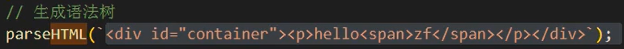

**模板结合数据，生成抽象语法树，描述html、js语法**

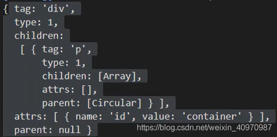

**语法树生成render函数**

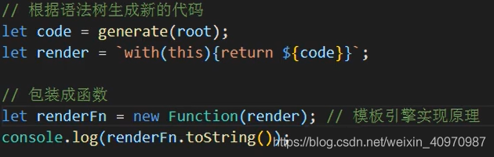**

 

**render函数**

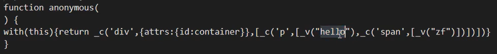

 

**生成Virtual Dom(虚拟dom)，描述真实的dom节点**

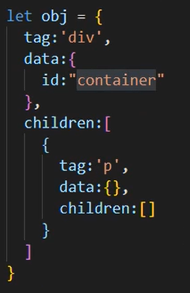

**渲染成真实dom**

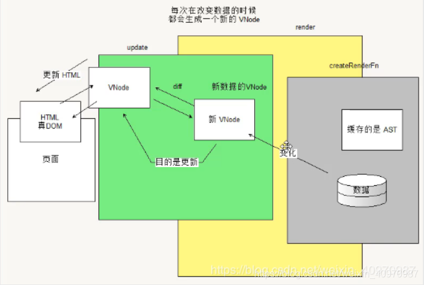


# 数据响应式相关


- vue data 中多少个数据需要响应式， 就有多少个 dep。

```js
export function defineReactive ( ) {
  const dep = new Dep()
	// ...
  Object.defineProperty(obj, key, {
    get: function reactiveGetter () {
      if (Dep.target) {
        dep.depend()
      }
      return value
    },
    set: function reactiveSetter (newVal) {
      val = newVal
      dep.notify()
    }
  })
}
```

- vue template 中`{{}}`使用了多少个data中的数据，就有多少个 watcher。
- dep 是收集 watcher 的。
- dep 和 watcher 都是多对多。

## 响应式数据的原理

**vue3——核心点：proxy（代理）—— 直接处理对象**

**解决了vue2中的处理对象递归、处理数组麻烦的问题**。


**vue2——核心点：Object.defineProperty —— 修改每一个属性**

默认Vue在初始化数据时，会给data中的属性使用Object.defineProperty，在获取和设置的进行拦截，重新定义所有属性。当页面取到对应属性时，会进行依赖收集（收集当前组件的watcher）。如果属性发生变化会通知相关依赖进行更新操作。
**依赖收集、派发更新的作用：**如果没有这项操作，每个数据更新就会去渲染页面，极大的消耗性能。加了这项操作，去监听相关数据的改变，添加到队列里，当所有改变完事儿之后，一起进行渲染。

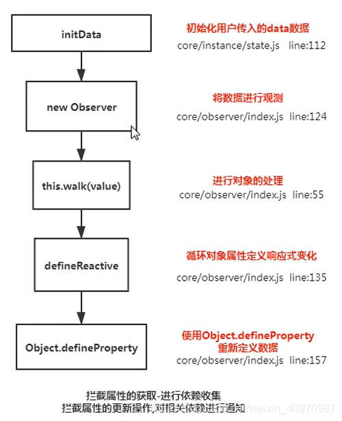

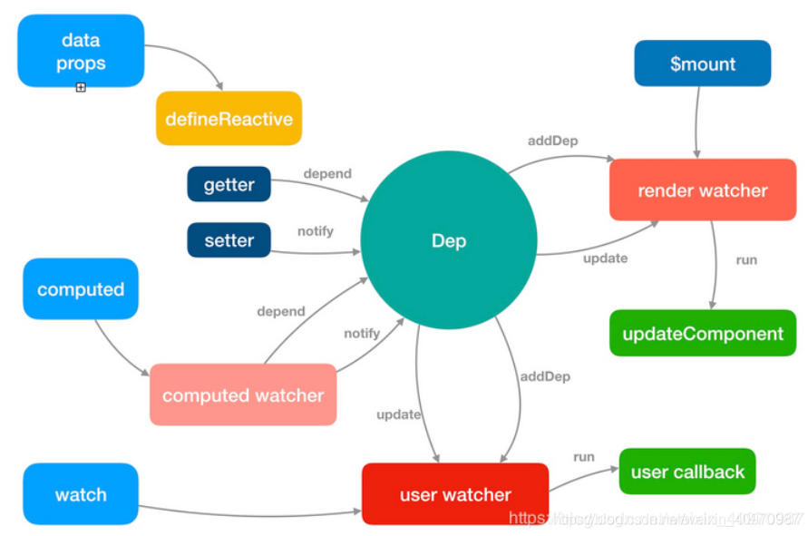

```js
/**
 * Define a reactive property on an Object.
 */
 /*为对象defineProperty上在变化时通知的属性*/
export function defineReactive (
  obj: Object,
  key: string,
  val: any,
  customSetter?: Function
) {
  /*在闭包中定义一个dep对象*/
  const dep = new Dep()

  const property = Object.getOwnPropertyDescriptor(obj, key)
  if (property && property.configurable === false) {
    return
  }

  /*如果之前该对象已经预设了getter以及setter函数则将其取出来，新定义的getter/setter中会将其执行，保证不会覆盖之前已经定义的getter/setter。*/
  // cater for pre-defined getter/setters
  const getter = property && property.get
  const setter = property && property.set

  /*对象的子对象递归进行observe并返回子节点的Observer对象*/
  let childOb = observe(val)
  Object.defineProperty(obj, key, {
    enumerable: true,
    configurable: true,
    get: function reactiveGetter () {
      /*如果原本对象拥有getter方法则执行*/
      const value = getter ? getter.call(obj) : val
      if (Dep.target) {
        /*进行依赖收集*/
        dep.depend()
        if (childOb) {
          /*子对象进行依赖收集，其实就是将同一个watcher观察者实例放进了两个depend中，一个是正在本身闭包中的depend，另一个是子元素的depend*/
          childOb.dep.depend()
        }
        if (Array.isArray(value)) {
          /*是数组则需要对每一个成员都进行依赖收集，如果数组的成员还是数组，则递归。*/
          dependArray(value)
        }
      }
      return value
    },
    set: function reactiveSetter (newVal) {
      /*通过getter方法获取当前值，与新值进行比较，一致则不需要执行下面的操作*/
      const value = getter ? getter.call(obj) : val
      /* eslint-disable no-self-compare */
      if (newVal === value || (newVal !== newVal && value !== value)) {
        return
      }
      /* eslint-enable no-self-compare */
      if (process.env.NODE_ENV !== 'production' && customSetter) {
        customSetter()
      }
      if (setter) {
        /*如果原本对象拥有setter方法则执行setter*/
        setter.call(obj, newVal)
      } else {
        val = newVal
      }
      /*新的值需要重新进行observe，保证数据响应式*/
      childOb = observe(newVal)
      /*dep对象通知所有的观察者*/
      dep.notify()
    }
  })
}
```


## vue中时如何检测数组变化

**使用了函数劫持的方式，重写了数组方法**

Vue将data中的数组，进行了原型链重写，指向了自己定义的数组原型方法。这样当调用数组api时，可以通知依赖更新。如果数组中包含着引用类型，会对数组中的引用类型再次进行监控。

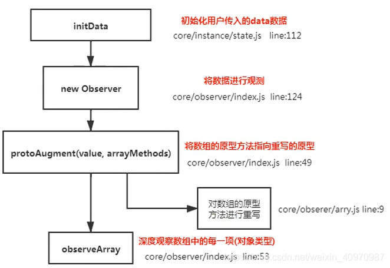

```js
/*
 * not type checking this file because flow doesn't play well with
 * dynamically accessing methods on Array prototype
 */
/*Github:https://github.com/answershuto*/
import { def } from '../util/index'

/*取得原生数组的原型*/
const arrayProto = Array.prototype
/*创建一个新的数组对象，修改该对象上的数组的七个方法，防止污染原生数组方法*/
export const arrayMethods = Object.create(arrayProto)

/**
 * Intercept mutating methods and emit events
 */
 /*这里重写了数组的这些方法，在保证不污染原生数组原型的情况下重写数组的这些方法，截获数组的成员发生的变化，执行原生数组操作的同时dep通知关联的所有观察者进行响应式处理*/
;[
  'push',
  'pop',
  'shift',
  'unshift',
  'splice',
  'sort',
  'reverse'
]
.forEach(function (method) {
  // cache original method
  /*将数组的原生方法缓存起来，后面要调用*/
  const original = arrayProto[method]
  def(arrayMethods, method, function mutator () {
    // avoid leaking arguments:
    // http://jsperf.com/closure-with-arguments
    let i = arguments.length
    const args = new Array(i)
    while (i--) {
      args[i] = arguments[i]
    }
    /*调用原生的数组方法*/
    const result = original.apply(this, args)

    /*数组新插入的元素需要重新进行observe才能响应式*/
    const ob = this.__ob__
    let inserted
    switch (method) {
      case 'push':
        inserted = args
        break
      case 'unshift':
        inserted = args
        break
      case 'splice':
        inserted = args.slice(2)
        break
    }
    if (inserted) ob.observeArray(inserted)
      
    // notify change
    /*dep通知所有注册的观察者进行响应式处理*/
    ob.dep.notify()
    return result
  })
})

```


## vue采用异步渲染

vue是组件级更新，如果不采用异步更新，那么每次更新数据都会对当前组件重新渲染。为了性能考虑，vue会在本轮数据更新后，再去异步更新视图。

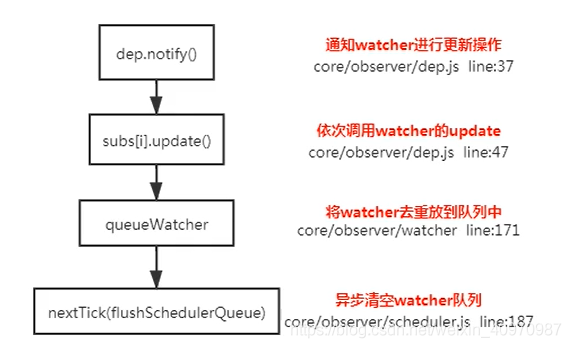

```js
/**
 * Push a watcher into the watcher queue.
 * Jobs with duplicate IDs will be skipped unless it's
 * pushed when the queue is being flushed.
 */
 /*将一个观察者对象push进观察者队列，在队列中已经存在相同的id则该观察者对象将被跳过，除非它是在队列被刷新时推送*/
export function queueWatcher (watcher: Watcher) {
  /*获取watcher的id*/
  const id = watcher.id
  /*检验id是否存在，已经存在则直接跳过，不存在则标记哈希表has，用于下次检验*/
  if (has[id] == null) {
    has[id] = true
    if (!flushing) {
      /*如果没有flush掉，直接push到队列中即可*/
      queue.push(watcher)
    } else {
      // if already flushing, splice the watcher based on its id
      // if already past its id, it will be run next immediately.
      let i = queue.length - 1
      while (i >= 0 && queue[i].id > watcher.id) {
        i--
      }
      queue.splice(Math.max(i, index) + 1, 0, watcher)
    }
    // queue the flush
    if (!waiting) {
      waiting = true
      nextTick(flushSchedulerQueue)
    }
  }
}
```

## nextTick实现原理

nextTick主要是使用了宏任务和微任务，定义了一个异步方法。多次调用nextTick会将方法存入队列中，通过这个异步方法清空当前队列，所以nextTick就是异步方法。

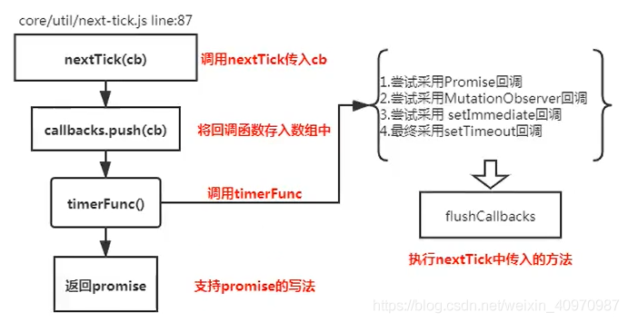

```js
/**
 * Defer a task to execute it asynchronously.
 */
 /*
    延迟一个任务使其异步执行，在下一个tick时执行，一个立即执行函数，返回一个function
    这个函数的作用是在task或者microtask中推入一个timerFunc，在当前调用栈执行完以后以此执行直到执行到timerFunc
    目的是延迟到当前调用栈执行完以后执行
*/
export const nextTick = (function () {
  /*存放异步执行的回调*/
  const callbacks = []
  /*一个标记位，如果已经有timerFunc被推送到任务队列中去则不需要重复推送*/
  let pending = false
  /*一个函数指针，指向函数将被推送到任务队列中，等到主线程任务执行完时，任务队列中的timerFunc被调用*/
  let timerFunc

  /*下一个tick时的回调*/
  function nextTickHandler () {
    /*一个标记位，标记等待状态（即函数已经被推入任务队列或者主线程，已经在等待当前栈执行完毕去执行），这样就不需要在push多个回调到callbacks时将timerFunc多次推入任务队列或者主线程*/
    pending = false
    /*执行所有callback*/
    const copies = callbacks.slice(0)
    callbacks.length = 0
    for (let i = 0; i < copies.length; i++) {
      copies[i]()
    }
  }

  // the nextTick behavior leverages the microtask queue, which can be accessed
  // via either native Promise.then or MutationObserver.
  // MutationObserver has wider support, however it is seriously bugged in
  // UIWebView in iOS >= 9.3.3 when triggered in touch event handlers. It
  // completely stops working after triggering a few times... so, if native
  // Promise is available, we will use it:
  /* istanbul ignore if */

  /*
    这里解释一下，一共有Promise、MutationObserver以及setTimeout三种尝试得到timerFunc的方法。
    优先使用Promise，在Promise不存在的情况下使用MutationObserver，这两个方法的回调函数都会在microtask中执行，它们会比setTimeout更早执行，所以优先使用。
    如果上述两种方法都不支持的环境则会使用setTimeout，在task尾部推入这个函数，等待调用执行。
    为啥要用 microtask？我在顾轶灵在知乎的回答中学习到：
    根据 HTML Standard，在每个 task 运行完以后，UI 都会重渲染，那么在 microtask 中就完成数据更新，
    当前 task 结束就可以得到最新的 UI 了。反之如果新建一个 task 来做数据更新，那么渲染就会进行两次。
    参考：https://www.zhihu.com/question/55364497/answer/144215284
  */
  if (typeof Promise !== 'undefined' && isNative(Promise)) {
    /*使用Promise*/
    var p = Promise.resolve()
    var logError = err => { console.error(err) }
    timerFunc = () => {
      p.then(nextTickHandler).catch(logError)
      // in problematic UIWebViews, Promise.then doesn't completely break, but
      // it can get stuck in a weird state where callbacks are pushed into the
      // microtask queue but the queue isn't being flushed, until the browser
      // needs to do some other work, e.g. handle a timer. Therefore we can
      // "force" the microtask queue to be flushed by adding an empty timer.
      if (isIOS) setTimeout(noop)
    }
  } else if (typeof MutationObserver !== 'undefined' && (
    isNative(MutationObserver) ||
    // PhantomJS and iOS 7.x
    MutationObserver.toString() === '[object MutationObserverConstructor]'
  )) {
    // use MutationObserver where native Promise is not available,
    // e.g. PhantomJS IE11, iOS7, Android 4.4
    /*新建一个textNode的DOM对象，用MutationObserver绑定该DOM并指定回调函数，在DOM变化的时候则会触发回调,该回调会进入主线程（比任务队列优先执行），即textNode.data = String(counter)时便会加入该回调*/
    var counter = 1
    var observer = new MutationObserver(nextTickHandler)
    var textNode = document.createTextNode(String(counter))
    observer.observe(textNode, {
      characterData: true
    })
    timerFunc = () => {
      counter = (counter + 1) % 2
      textNode.data = String(counter)
    }
  } else {
    // fallback to setTimeout
    /* istanbul ignore next */
    /*使用setTimeout将回调推入任务队列尾部*/
    timerFunc = () => {
      setTimeout(nextTickHandler, 0)
    }
  }

  /*
    推送到队列中下一个tick时执行
    cb 回调函数
    ctx 上下文
  */
  return function queueNextTick (cb?: Function, ctx?: Object) {
    let _resolve
    /*cb存到callbacks中*/
    callbacks.push(() => {
      if (cb) {
        try {
          cb.call(ctx)
        } catch (e) {
          handleError(e, ctx, 'nextTick')
        }
      } else if (_resolve) {
        _resolve(ctx)
      }
    })
    if (!pending) {
      pending = true
      timerFunc()
    }
    if (!cb && typeof Promise !== 'undefined') {
      return new Promise((resolve, reject) => {
        _resolve = resolve
      })
    }
  }
})()
```


## vue中computed的特点

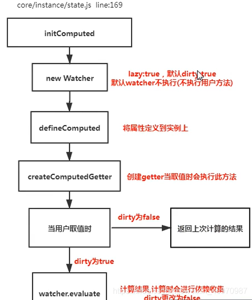

```js
/*初始化computed*/
function initComputed (vm: Component, computed: Object) {
  const watchers = vm._computedWatchers = Object.create(null)

  for (const key in computed) {
    const userDef = computed[key]
    /*
      计算属性可能是一个function，也有可能设置了get以及set的对象。
      可以参考 https://cn.vuejs.org/v2/guide/computed.html#计算-setter
    */
    let getter = typeof userDef === 'function' ? userDef : userDef.get
    if (process.env.NODE_ENV !== 'production') {
      /*getter不存在的时候抛出warning并且给getter赋空函数*/
      if (getter === undefined) {
        warn(
          `No getter function has been defined for computed property "${key}".`,
          vm
        )
        getter = noop
      }
    }
    // create internal watcher for the computed property.
    /*
      为计算属性创建一个内部的监视器Watcher，保存在vm实例的_computedWatchers中
      这里的computedWatcherOptions参数传递了一个lazy为true，会使得watch实例的dirty为true
    */
    watchers[key] = new Watcher(vm, getter, noop, computedWatcherOptions)

    // component-defined computed properties are already defined on the
    // component prototype. We only need to define computed properties defined
    // at instantiation here.
    /*组件正在定义的计算属性已经定义在现有组件的原型上则不会进行重复定义*/
    if (!(key in vm)) {
      /*定义计算属性*/
      defineComputed(vm, key, userDef)
    } else if (process.env.NODE_ENV !== 'production') {
      /*如果计算属性与已定义的data或者props中的名称冲突则发出warning*/
      if (key in vm.$data) {
        warn(`The computed property "${key}" is already defined in data.`, vm)
      } else if (vm.$options.props && key in vm.$options.props) {
        warn(`The computed property "${key}" is already defined as a prop.`, vm)
      }
    }
  }
}

/*定义计算属性*/
export function defineComputed (target: any, key: string, userDef: Object | Function) {
  if (typeof userDef === 'function') {
    /*创建计算属性的getter*/
    sharedPropertyDefinition.get = createComputedGetter(key)
    /*
      当userDef是一个function的时候是不需要setter的，所以这边给它设置成了空函数。
      因为计算属性默认是一个function，只设置getter。
      当需要设置setter的时候，会将计算属性设置成一个对象。参考：https://cn.vuejs.org/v2/guide/computed.html#计算-setter
    */
    sharedPropertyDefinition.set = noop
  } else {
    /*get不存在则直接给空函数，如果存在则查看是否有缓存cache，没有依旧赋值get，有的话使用createComputedGetter创建*/
    sharedPropertyDefinition.get = userDef.get
      ? userDef.cache !== false
        ? createComputedGetter(key)
        : userDef.get
      : noop
    /*如果有设置set方法则直接使用，否则赋值空函数*/
    sharedPropertyDefinition.set = userDef.set
      ? userDef.set
      : noop
  }
  /*defineProperty上getter与setter*/
  Object.defineProperty(target, key, sharedPropertyDefinition)
}

/*创建计算属性的getter*/
function createComputedGetter (key) {
  return function computedGetter () {
    const watcher = this._computedWatchers && this._computedWatchers[key]
    if (watcher) {
      /*实际是脏检查，在计算属性中的依赖发生改变的时候dirty会变成true，在get的时候重新计算计算属性的输出值*/
      if (watcher.dirty) {
        watcher.evaluate()
      }
      /*依赖收集*/
      if (Dep.target) {
        watcher.depend()
      }
      return watcher.value
    }
  }
}
```

详解 https://www.cnblogs.com/vickylinj/p/14034645.html


# 参考

https://www.cnblogs.com/vickylinj/p/13529926.html
