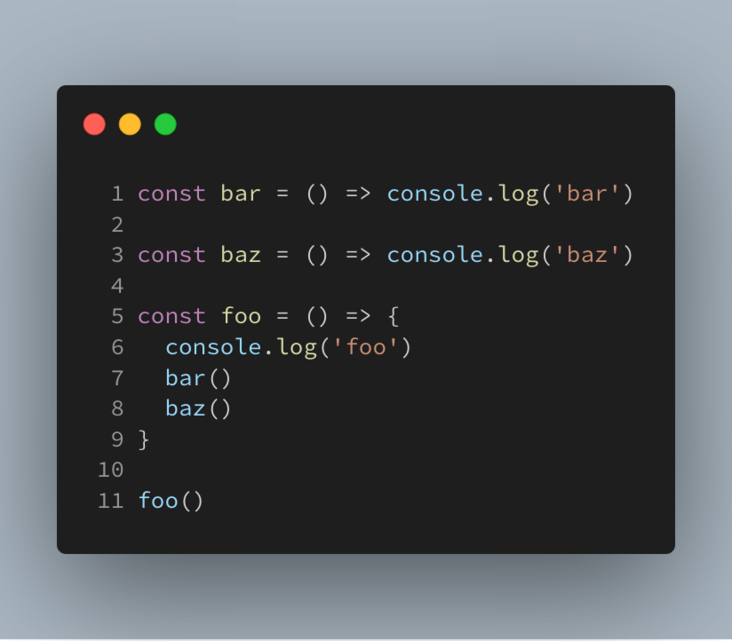

# 概念
JavaScript 是一门 单线程 语言，即同一时间只能执行一个任务，即代码执行是同步并且阻塞的。

- 队列（Queue）**先进先出**
- 栈（Stack）**后进先出**。
- 调用栈（Call Stack）

调用栈示意图

Javascript 有一个 main thread 主线程和 call-stack 调用栈(执行栈)，所有的任务都会被放到调用栈等待主线程执行。

- 宏任务会一个一个执行。不会死循环

- animation callbacks 执行完一轮，如果动画回调又有动画回调（新增的）下一轮再执行

- 微任务一直新增会一直执行，直到执行完。会死循环
