# 输入 url 到页面显示发生了什么？

这是一篇关于 `输入 url 到页面显示发生了什么？` 的笔记。

下面是此笔记整体的一个概述，后续由于涉及到的知识层面很多。会不断填充此笔记。

## 概述

知识点分为两部分

- **网络通信**

  湖南科技大学-计算机网络 [学银在线](http://www.xueyinonline.com/detail/216843891) / [中国大学 MOOC（慕课）](https://www.icourse163.org/course/HNKJ-1461816178) / [BiliBili](https://www.bilibili.com/video/BV1c4411d7jb)

  书籍[《网络是怎样连接的》](../../resources/网络是怎样连接的.pdf)

- **浏览器渲染**

  [Google Developers](https://developers.google.com/web/fundamentals/performance/critical-rendering-path/render-tree-construction?hl=zh-cn)

### 网络通信

网络包的旅程，具体过程如下图

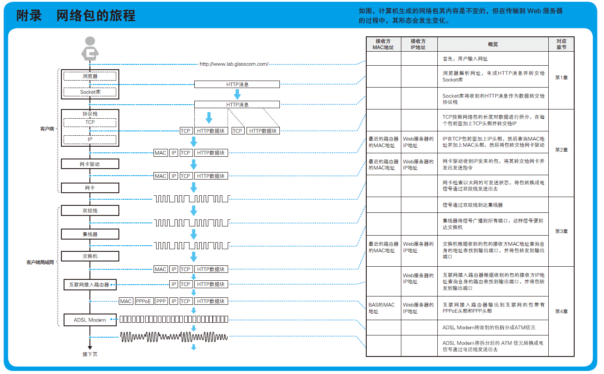

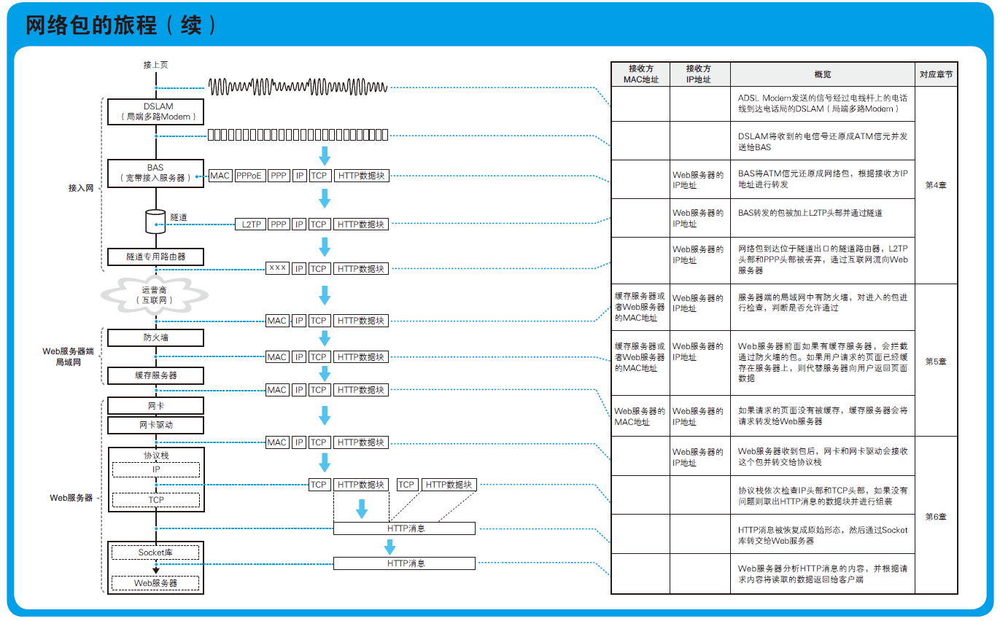

_图 1 来源书籍《网络是怎样连接的》_

1.  Web 浏览器

一切都是从在浏览器中输入网址（URL）开始的。例如，当我们输入下面这样的网址
http://www.lab.glasscom.com/sample1.html

浏览器生成的请求消息表示“请给我 `sample1.html` 这一文件中储存的网页数据”。即委托操作系统中的网络控制软件将消息发送给服务器。

2. 协议栈、网卡

   `协议栈` 将从浏览器接收到的消息打包，加上目的地址等控制信息，然后将包交给网卡（负责以太网或无线网络通信的硬件）。然后，网卡会将包转换为电信号并通过网线发送出去。这样一来，包就进入到网络之中了。

3. 集线器、交换机、路由器

   网卡发送的包会经过交换机等设备，到达用来接入互联网的路由器。路由器的后面就是互联网，网络运营商会负责将包送到目的地。

4. 接入网、网络运营商

   数据从用来接入互联网的路由器出发，进入了互联网的内部。互联网的入口线路称为 `接入网`。网络包首先通过接入网被发送到接入点，然后再从这里被发送到全国甚至全世界。接入点的后面就是互联网的骨干部分了。

5. 防火墙、缓存服务器

   通过 `骨干网` 之后，网络包最终到达了 Web 服务器所在的局域网中。接着，它会遇到防火墙，防火墙会对进入的包进行检查。

   检查完之后，网络包接下来可能还会遇到 `缓存服务器`。网页数据中有一部分是可以重复利用的，这些可以重复利用的数据就被保存在缓存服务器中。

6. Web 服务器

当网络包到达 Web 服务器后，数据会被解包并还原为原始的请求消息，然后交给 Web 服务器程序。和客户端一样，这个操作也是由操作系统中的协议栈（网络控制软件）来完成的。

接下来，Web 服务器程序分析请求消息的含义，并按照其中的指示将数据装入响应消息中，然后发回给客户端。响应消息回到客户端的过程和之前我们介绍的过程正好相反。

当响应到达客户端之后，浏览器会从中读取出网页的数据并在屏幕上显示出来。到这里，访问 Web 服务器的一系列操作就全部完成了。

### 浏览器渲染

下面简要概述了浏览器完成的步骤:

1. 处理 HTML 标记并构建 DOM 树。

2. 处理 CSS 标记并构建 CSSOM 树。

3. 将 DOM 与 CSSOM 合并成一个渲染树。

4. 根据渲染树来布局，以计算每个节点的几何信息。

5. 将各个节点绘制到屏幕上。

浏览器渲染页面前需要先构建 `DOM` 和 `CSSOM` 树。

- 字节 → 字符 → 令牌 → 节点 → 对象模型。

渲染树构建、布局及绘制

CSSOM 树和 DOM 树合并成渲染树，然后用于计算每个可见元素的布局，并输出给绘制流程，将像素渲染到屏幕上。

---

## 开始

首先回顾下 `常见的网络体系结构`

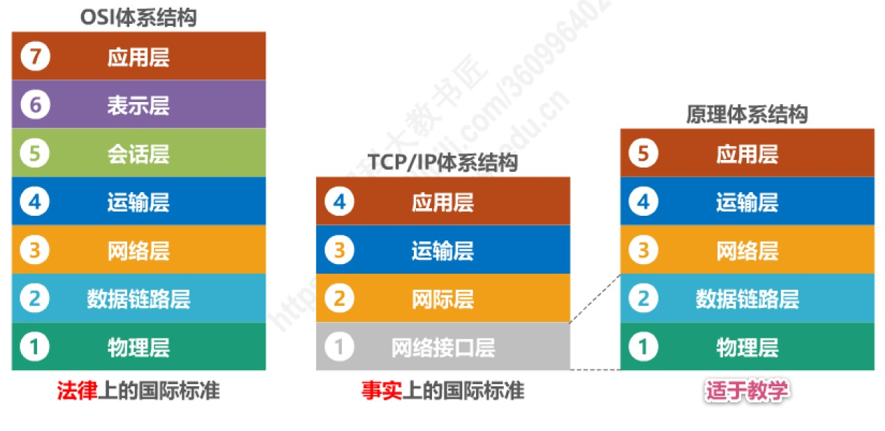

### Web 浏览器

#### 1. HTTP 请求

故事从浏览器地址栏 `https://www.lab.glasscom.com` 说起。

浏览器开始请求 `www.lab.glasscom.com/ `根目录下的`index`文件，生成 `HTTP`消息。

浏览器和 Web 服务器根据此格式来生成消息。

下图为 HTTP 消息的格式

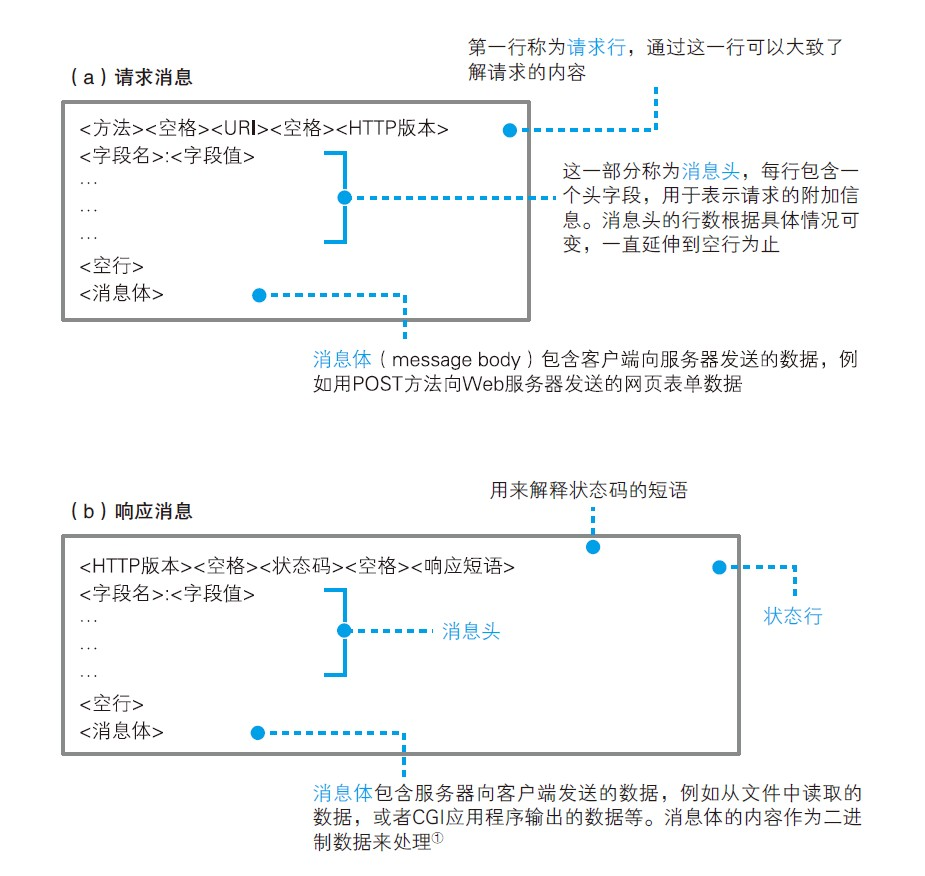

#### 2. DNS

> **DNS：Domain Name System**，域名服务系统。将服务器名称和 IP 地址进行关联是 DNS 最常见的用法，但 DNS 的功能并不仅限于此，它还可以将邮件地址和邮件服务器进行关联，以及为各种信息关联相应的名称。

生成请求消息后，需要找到对应的服务器，将请求发送出去。

但是根据 `域名`是找不到对应的服务器的，所以需要查询网址中对应服务器域名的 `IP` 地址。

方法也很简单只要询问最近的 DNS 服务器 `www.lab.glasscom.com` 的 `IP` 地址是什么。

> 对于 DNS 服务器，我们的计算机上一定有相应的 DNS 客户端，而相当于 DNS 客户端的部分称为 DNS 解析器，或者简称解析器。通过 DNS 查询 IP 地址的操作称为域名解析，因此负责执行解析（resolution）这一操作的就叫解析器（resolver）了。

调用解析器后，解析器会向 DNS 服务器发送查询消息，然后 DNS 服务器会返回响应消息。响应消息中包含查询到的 IP 地址，解析器会取出 IP 地址，并将其写入浏览器指定的内存地址中。

**拿到 IP 可并没有那么容易**，下面看看内部：

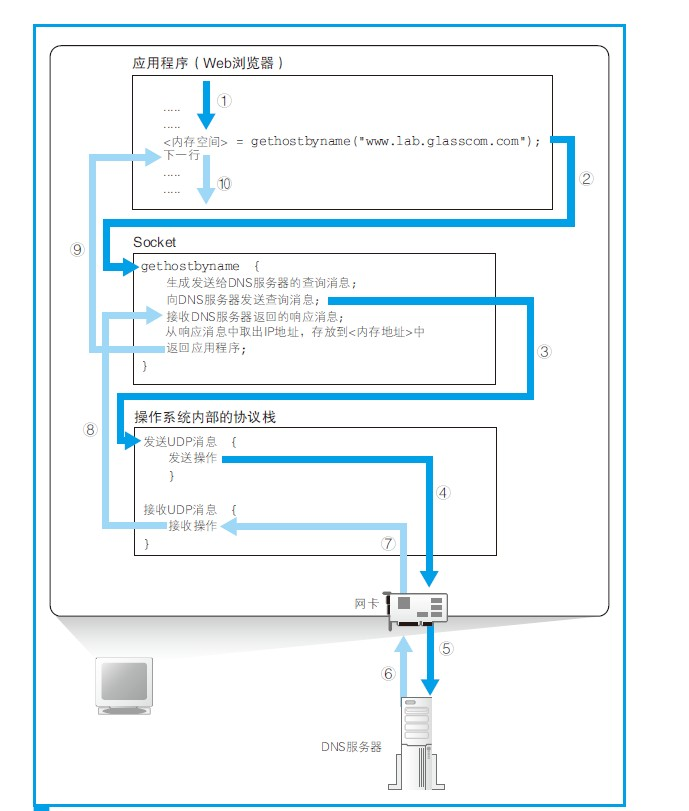

_解析器内部_

解析器委托操作系统内部的协议栈来发送`UDP`请求，通过网卡发送到最近的 `DNS`服务器。

**DNS 服务器会从域名与 IP 地址的对照表中查找相应的记录，并返回 IP 地址。**

如果有缓存则直接返回，要是没有的话，这台 `DNS` 服务器，就去问他的老大 `根 DNS`，如下图，

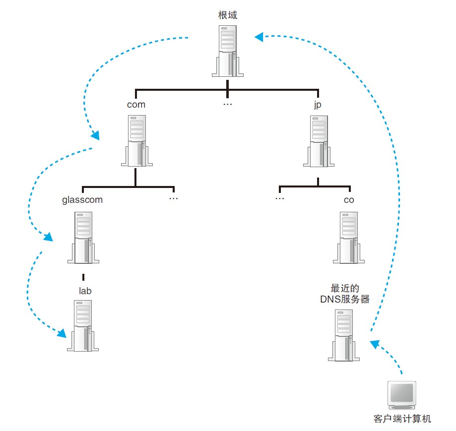

结合 url 来看， `www.lab.glasscom.com.` 注意 url 最后的一个点，那个点就是 `根域`。一般默认不写。从右到左一直寻找，找到 IP。

上图只是整体的一个流程，DNS 服务器之间的查询操作原理，如下图

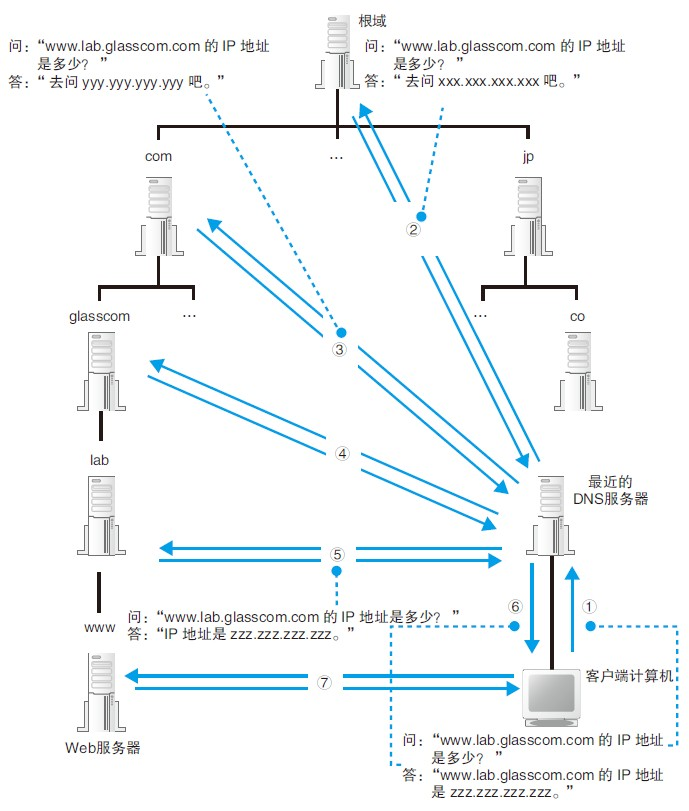

实际上，有时候一个 DNS 服务器会管理多个域，可以直接跳过一级。有时候不需要从跟域开始，因为 DNS 服务器有缓存功能，结果不存在也会被缓存起来，当然缓存会有一个有效期。

**至此已经拿到网址对应的 IP。**

#### 3. 协议栈、网卡

> 大体流程：收到应用程序（如：浏览器）的委托后，IP 模块会将包的内容当作一整块数据，在前面加上包含控制信息的头部。
> 封装好的包会被交给网卡，网卡会将这些数字信息转换为电信号或光信号，并通过网线（或光纤）发送出去，然后这些信号就会到达集线器、路由器等转发设备，再由转发设备一步一步地送达接收方。

为了更好了解协议栈是如何工作的，下面介绍和回顾协议栈流程相关涉及的内容

如下图

- 应用程序

也就是浏览器、电子邮件客户端、Web 服务器、电子邮件服务器等程序，它们会将收发数据等工作委派给下层的部分来完成。

应用程序的下面是 Socket 库，其中包括解析器，解析器用来向 DNS 服务器发出查询

- 操作系统-协议栈

协议栈的上半部分有两块，分别是负责用 `TCP 协议` 收发数据的部分和负责用 `UDP 协议 `收发数 据的部分，它们会接受应用程序的委托执行收发数据的操作。

> 浏览器、邮件等一般应用程序收发数据时用 TCP；
> DNS 查询等收发较短的控制数据时用 UDP。

下面一半是用 IP 协议控制网络包收发操作的部分。

IP 中还包括 `ICMPA 协议`和 `ARPB 协议`。

> ICMP 用于告知网络包传送过程中产生的错误以及各种控制消息 ;
> ARP 用于根据 IP 地址查询相应的以太网 MAC 地址。

- 驱动程序-网卡驱动

IP 下面的网卡驱动程序负责控制网卡硬件，而最下面的网卡则负责完成实际的收发操作，也就是对网线中的信号执行发送和接收的操作。

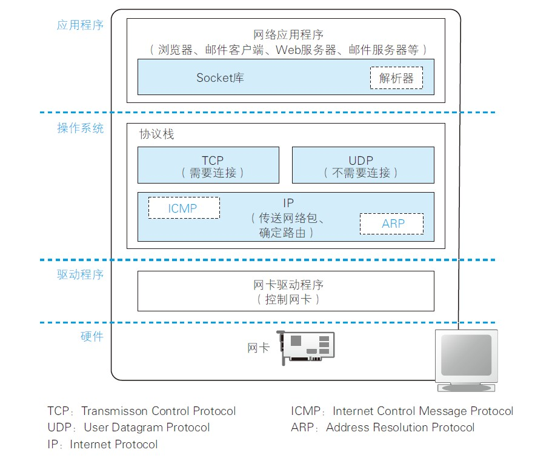

回到协议栈，

收到委托后，IP 模块会将包的内容当作一整块数据，在前面加上包含控制信息的头部。

> IP 模块负责添加如下两个头部。
> （1） MAC 头部：以太网用的头部，包含 MAC 地址
> （2） IP 头部：IP 用的头部，包含 IP 地址

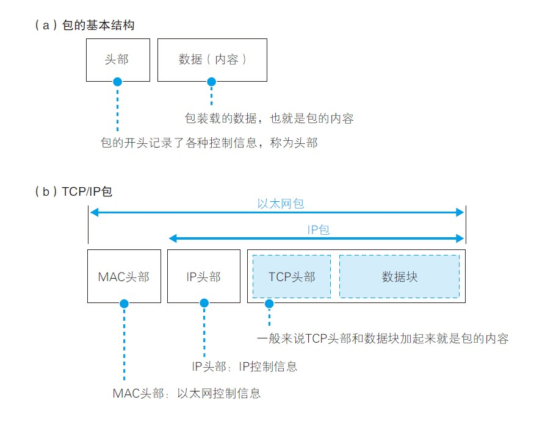

接下来，封装好的包会被交给网卡，网卡会将这些数字信息转换为电信号或光信号，并通过网线（或光纤）发送出去，然后这些信号就会到达集线器、路由器等转发设备，再由转发设备一步一步地送达接收方。

发送前要做的事，就是连接：

**TCP 三次握手：使用套接字格式建立连接**

1). 创建套接字阶段

`应用程序`调用 socket() 申请创建套接字，协议栈根据应用程序的申请执行创建套接字的操作。

将表示这个套接字的`描述符`告知应用程序。这时，只要我们出示描述符，协议栈就能够判断出我们希望用哪一个套接字来连接或者收发数据了。

> 应用程序是通过“描述符”这一类似号码牌的东西来识别套接字的。

2). 连接阶段

应用程序通过调用 Socket 库中的名为 `connect` 的程序组件（函数）来完成这一操作。

这里的要点是当调用 `connect()` 时，需要指定`描述符`、`服务器IP 地址`和`端口号`这 3 个参数

> 描述符：应用程序用来识别套接字的机制
> IP 地址和端口号：客户端和服务器之间用来识别对方套接字的机制

使用 `connect()` 建立连接时，客户端和服务器端会相互发送三个数据包。

客户端调用 `socket()` 创建套接字后，因为没有建立连接，所以套接字处于 `CLOSED`

插入面试题:

- 三报文握手

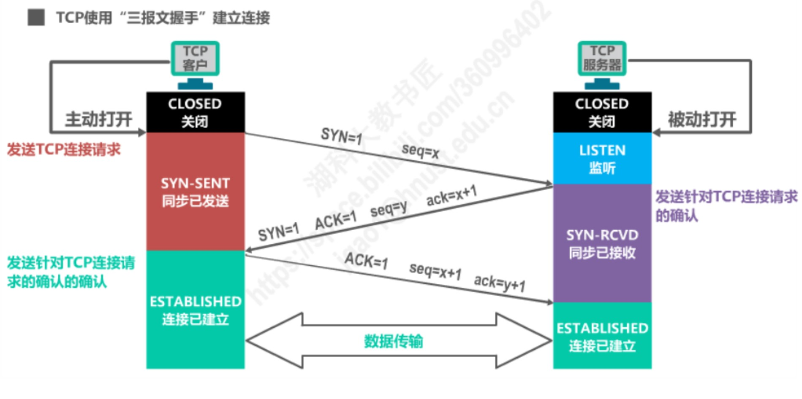

首先是服务器被动打开链接，进入 `监听` 等待客户端来请求；

**客户端发送 TCP 连接请求，进入 `同步已发送` 状态。**

TCP 连接请求报文段首部中的同步位 `SYN` 被设置为 `1`,表明这是一个 TCP 连接请求报文段，序号字段 seq 被设置了一个初始值 x

> 注意：TCP 规定 SYN 被设置为 1 的报文段不能携带数据，但要消耗掉一个序号。

**服务器收到请求后，如果同意建立连接，则向 客户端发送 TCP 连接请求确认报文段，并进入同步已接收状态**

该报文段中首部中的同步位 SYN 和 确认位 ACK 都是设置为 1，表明这是一个 TCP 连接请求确认报文段，序号字段 seq 被设置了一个初始值 y，确认号字段 ack 的值被设置成了 x+1，是对客户端所选择的初始序号的确认。

**客户端收到 TCP 连接请求确认报文段后，还要向服务器发送一个普通的 TCP 确认报文段，进入连接已建立状态。**

该报文段首部中的确认位 ACK 被设置为 1，表明这是一个普通的 TCP 确认报文段。序号 sep 被设置为 x+1，这是因为客户端发送的滴液 TCP 报文段的序号为 x。确认号字段 ack 的值被设置成了 y+1，是对服务器所选择的初始序号的确认。

> 注意：TCP 规定 普通的 TCP 确认报文段可以携带数据，但如果不携带数据，不消耗序号。假如本次不携带数据，那么下一个数据报文段的序号仍是 x+1。

服务器收到该确认报文段后也进入连接已建立状态。

现在可以基于建立好的连接进行可靠的数据传输了。

- 为什么不是 2 次或者是 4 次？

假设进行 `两报文握手`

首次请求的报文段在某些网络结点长时间滞留了，必然会造成该报文段的超时重传。

当重传的报文段完成数据传输，并释放连接后。TCP 双方都进入了关闭状态。

**一段时间后，之前滞留在网络中的失效 TCP 请求的报文段到达了 服务器。**

服务器会误认为这是 客户端又发起了一个新的 TCP 连接请求,于是给 客户端发送 TCP 连接请求确认报文段，并建立连接已建立状态。

**该报文段进到 客户端，由于 客户端并没有发起新的 TCP 连接请求，并且处于关闭状态，因此不会理会该报文段。**

但是 服务器已进入连接已建立状态，它认为新的 TCP 连接已建立好了，并一直等待 客户端发来数据，这将白白浪费 服务器所在主机的很多资源。

**综上所述，使用 `三报文握手`，而不是 `两报文握手`来简历 TCP 连接，是为了防止已失效的连接请求报文段突然又传送到了 TCP 服务器，因而导致错误。**

**三报文握手已经满足需求，不需要四报文握手。**

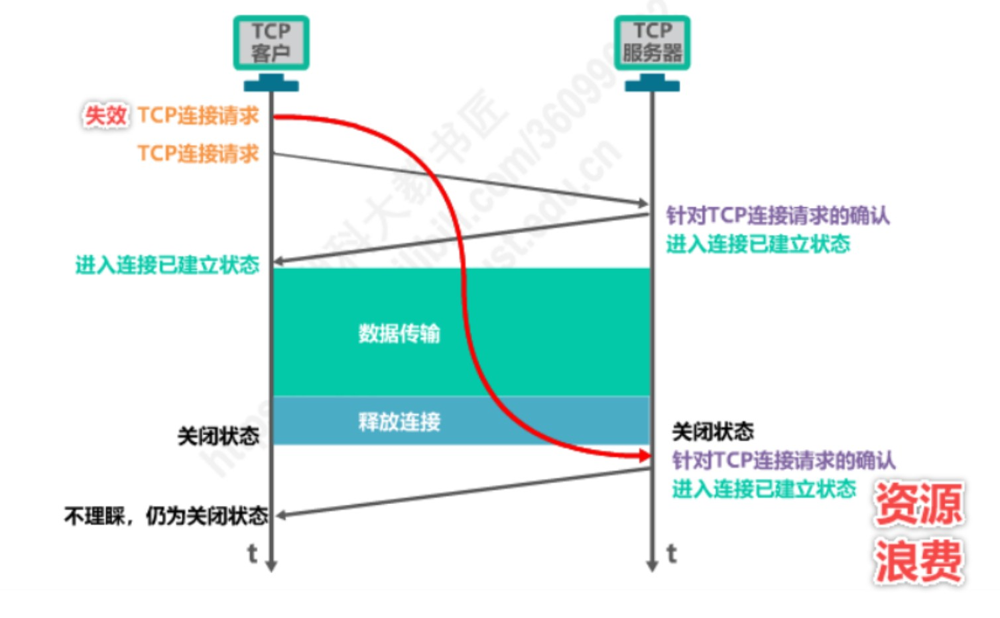

- 为什么一定要进行三次握手来保证连接是双工？

  **客户端发送连接请求， TCP 服务器响应。**

以上两次握手说明， TCP 服务器能够理解 TCP 客户端的请求并且能够正确响应。

 **客户端确认 TCP 服务器的响应**

第三次握手说明， 客户端能够理解 TCP 服务器的响应。

---

3). 通信阶段

- 发送

应用程序需要在内存中准备好要发送的数据，也就是封装好的网络包。

接下来，当调用 `write()` 时，需要指定描述符和发送数据，然后协议栈就会将数据发送到服务器。由于套接字中已经保存了已连接的通信对象的相关信息。

所以只要通过描述符指定套接字，就可以识别出通信对象，并向其发送数据。

接着，发送数据会通过网络到达我们要访问的服务器。

- 接收

接收信息的操作通过 Socket 库中的 `read()` 委托协议栈来完成的。

当服务器返回响应消息时，read 就会负责将接收到的响应消息存放到接收缓冲区中。

由于接收缓冲区是一块位于应用程序内部的内存空间，因此当消息被存放到接收缓冲区中时，就相当于已经转交给了应用程序。

4). 断开阶段

当 `服务器`发送完响应消息之后，应该主动执行断开操作，因此 `服务器`会首先调用 `close` 来断开连接。断开操作传达到`客户端`之后，`客户端`的套接字也会进入断开阶段。接下来，当`浏览器`调用 `read` 执行接收数据操作时，`read` 会告知`浏览器`收发数据操作已结束，连接已经断开。`浏览器`得知后，也会调用 `close` 进入断开阶段。

下面假设是客户端发起主动关闭。

- 四报文挥手

假设由客户端通知服务器关闭连接。

**客户端发送 TCP 连接释放报文段，并进入终止等待 1 状态。**

该报文段中的 FIN、ACK 的值都被设置为 1，表明这是一个 TCP 连接释放报文段。

同时也对之前收到的报文段进行确认，序号 seq 的值为设置为 u，它等于客户端之前已传送过的数据的最后一个字节的序号加 1。

> 注意： TCP 规定终止位 FIN 等于 1 的报文段即使不携带数据，也要消耗掉一个序号。

确认号 ack 的值设置为 v，它等于客户端之前已收到的数据的最后一个字节的序号加 1。

**服务器收到 TCP 连接释放报文段后，会发送一个普通的 TCP 确认报文段，并进入关闭等待状态。**

该报文段首部中的确认位 ACK 的值被设置为 1，表明这是一个普通的 TCP 确认报文段。序号 seq 的值被设置为 v，它等于服务器之前已传送过的数据的最后一个字节的序号加 1。确认号 ack 的值被设置为 u+1。

**此时，从客户端到服务器这个方向的连接就释放了。这时候的 TCP 连接属于半关闭状态，也就是客户端没有数据要发送了。但如果服务器还有数据要发送，客户端还是要接收。即从服务器到客户端这个方向的连接并未关闭**

**客户端收到 TCP 确认报文段后，进入终止等待 2 状态。等待服务器发出的 TCP 连接释放报文段。**

**此时，服务器开始发出 TCP 连接释放报文段，并进入最后确认状态**

该报文段中的 FIN、ACK 的值都被设置为 1，表明这是一个 TCP 连接释放报文段。

同时也对之前收到的报文段进行确认，假定序号 seq 的值为 w（这是因为在半关闭状态下，服务器可能又发送了一些数据）。

确认号 ack 的值为 u+1，这是对之前收到的 TCP 释放报文段的重复确认。

**客户端收到服务器的 TCP 连接释放报文段后，必须针对该报文段发送普通的 TCP 确认报文段，之后进入时间等待状态。**

该报文段首部中的确认位 ACK 的值被设置为 1，表明这是一个普通的 TCP 确认报文段。序号 seq 的值被设置为 u+1，它等于客户端之前已传送过的数据的最后一个字节的序号加 1。确认号 ack 的值被设置为 w+1。

**服务器收到该报文段后，就进入关闭状态。**

**而客户端还要经过两倍 MSL 后才能进入关闭状态。**

- 为什么需要经过两倍 MSL 后才能进入关闭状态？

等待 2MSL 是因为保证服务器接收到了 ACK 报文，因为网络是复杂了，很有可能 ACK 报文丢失了，如果服务器没接收到 ACK 报文的话，会重新发送 FIN 报文，只有当客户端等待了 2MSL 都没有收到重发的 FIN 报文时就表示服务器是正常收到了 ACK 报文，那么这个时候客户端就可以关闭了。

也使得下一个 TCP 连接不会出现旧连接中的报文段。

- 为什么一定要进行四次挥手

因为握手的时候并没有数据传输，所以服务器的 SYN 和 ACK 报文可以一起发送，但是挥手的时候有数据在传输，所以 ACK 和 FIN 报文不能同时发送，需要分两步，所以会比握手多一步。

### 集线器、交换机、路由器

网络包已经整装待发，出了网卡等待转发。从计算机发送出来的网络包会通过集线器、路由器等设备被转发，最终到达目的地。

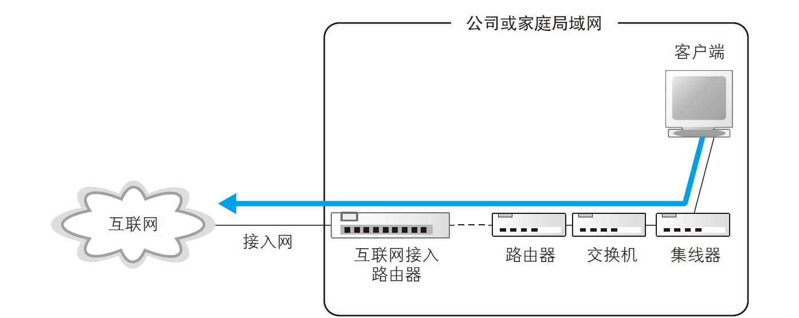

#### 1. 集线器传输

> 集线器（Hub）是指将多条以太网双绞线或光纤集合连接在同一段物理介质下的设备。发生在物理层。

当信号到达集线器后，会被广播到整个网络中。以太网的基本架构就是将包发到所有的设备，然后由设备根据接收方MAC 地址来判断应该接收哪些包。

#### 2. 交换机的转发操作

> 交换机：（Switch）是一种用于电（光）信号转发的网络设备。它可以为接入交换机的任意两个网络节点提供独享的电信号通路，把传输的信息送到符合要求的相应路由上。发生在数据链路层。

将网线中的信号转换为通用格式，然后传递给MAC 模块。MAC 模块将信号转换为数字信息，放到缓冲区中

接下来需要查询一下这个包的接收方MAC 地址，可以通过交换电路将包发送到相应的端口。

> 交换机根据MAC 地址表查找MAC 地址，然后将信号发送到相应的端口。

#### 3. 路由器的转发操作

> 路由器：（Router）是连接因特网中各局域网、广域网的设备。在路由器中记录着路由表，它会根据信道的情况自动选择和设定路由，以最佳路径，按前后顺序发送信号。发生在网络层。

网络包经过集线器和交换机之后，现在到达了路由器，并在此被转发到下一个路由器。这一步转发的工作原理和交换机类似，也是通过查表判断包转发的目标。

交换机是通过MAC 头部中的接收方MAC 地址来判断转发目标的，而路由器则是根据IP 头部中的IP 地址来判断的。

### 接入网、网络运营商

网络包通过交换机和路由器的转发一步一步地接近它的目的地，在通过互联网接入路由器之后，就进入了互联网。

*(正在努力学习中...)*

### 防火墙、缓存服务器

*(正在努力学习中...)*

### Web 服务器

*(正在努力学习中...)*

---

### 浏览器渲染

到此，已经拿到资源。

#### 构建对象模型

浏览器渲染页面前需要先构建 DOM 和 CSSOM 树。因此，我们需要确保尽快将 HTML 和 CSS 都提供给浏览器。

- 字节 → 字符 → 令牌 → 节点 → 对象模型。
- HTML 标记转换成文档对象模型 (DOM)；CSS 标记转换成 CSS 对象模型 (CSSOM)。
- DOM 和 CSSOM 是独立的数据结构。
- Chrome DevTools Timeline 让我们可以捕获和检查 DOM 和 CSSOM 的构建和处理开销。

#### 

##### 文档对象模型 (DOM)

1. **转换: ** 浏览器从磁盘或网络读取 HTML 的原始字节，并根据文件的指定编码（例如 UTF-8）将它们转换成各个字符。
2. **令牌化: ** 浏览器将字符串转换成 [W3C HTML5 标准](http://www.w3.org/TR/html5/)规定的各种令牌，例如，“<html>”、“<body>”，以及其他尖括号内的字符串。每个令牌都具有特殊含义和一组规则。
3. **词法分析: ** 发出的令牌转换成定义其属性和规则的“对象”。
4. **DOM 构建: ** 最后，由于 HTML 标记定义不同标记之间的关系（一些标记包含在其他标记内），创建的对象链接在一个树数据结构内，此结构也会捕获原始标记中定义的父项-子项关系: *HTML* 对象是 *body* 对象的父项，*body* 是 *paragraph* 对象的父项，依此类推。

##### CSS 对象模型 (CSSOM)

在浏览器构建我们这个简单页面的 DOM 时，在文档的 head 部分遇到了一个 link 标记，该标记引用一个外部 CSS 样式表: style.css。由于预见到需要利用该资源来渲染页面，它会立即发出对该资源的请求。

与 HTML过程类似，从接收到转换。CSS 字节转换成字符，接着转换成令牌和节点

最后链接到一个称为“CSS 对象模型”(CSSOM) 的树结构内:

#### 渲染树构建、布局及绘制

CSSOM 树和 DOM 树合并成渲染树，然后用于计算每个可见元素的布局，并输出给绘制流程，将像素渲染到屏幕上。

- DOM 树与 CSSOM 树合并后形成渲染树。
- 渲染树只包含渲染网页所需的节点。
- 布局计算每个对象的精确位置和大小。
- 最后一步是绘制，使用最终渲染树将像素渲染到屏幕上。

为构建渲染树，浏览器大体上完成了下列工作:

1. 从 DOM 树的根节点开始遍历每个可见节点。
   - 某些节点不可见（例如脚本标记、元标记等），因为它们不会体现在渲染输出中，所以会被忽略。
   - 某些节点通过 CSS 隐藏，因此在渲染树中也会被忽略，例如，上例中的 span 节点---不会出现在渲染树中，---因为有一个显式规则在该节点上设置了“display: none”属性。
2. 对于每个可见节点，为其找到适配的 CSSOM 规则并应用它们。
3. 发射可见节点，连同其内容和计算的样式。

> 请注意 `visibility: hidden` 与 `display: none` 是不一样的。前者隐藏元素，但元素仍占据着布局空间（即将其渲染成一个空框），而后者 (`display: none`) 将元素从渲染树中完全移除，元素既不可见，也不是布局的组成部分。

最终输出的渲染同时包含了屏幕上的所有可见内容及其样式信息。**有了渲染树，我们就可以进入“布局”阶段。**

到目前为止，我们计算了哪些节点应该是可见的以及它们的计算样式，但我们尚未计算它们在设备视口内的确切位置和大小---这就是“布局”阶段，也称为“`自动重排`”。

为弄清每个对象在网页上的确切大小和位置，浏览器从渲染树的根节点开始进行遍历。

最后，既然我们知道了哪些节点可见、它们的计算样式以及几何信息，我们终于可以将这些信息传递给最后一个阶段: 将渲染树中的每个节点转换成屏幕上的实际像素。这一步通常称为“`绘制`”或“`栅格化`”。

---
